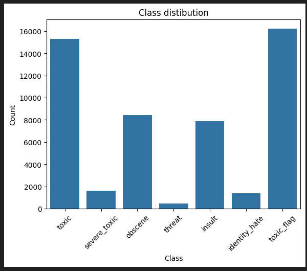
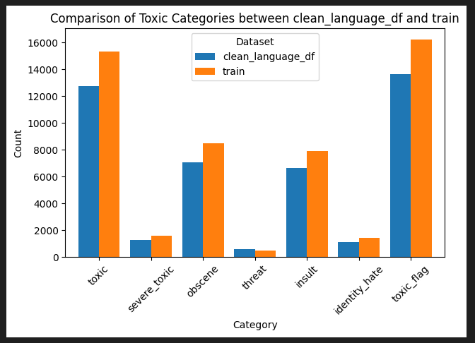
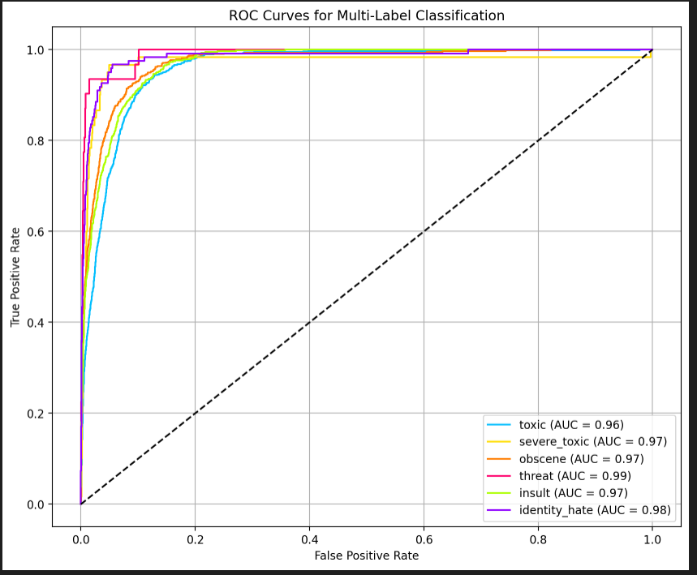
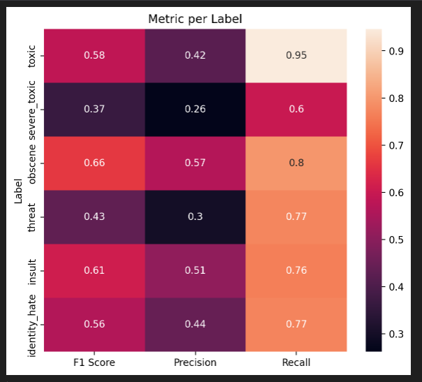

# Toxic Comment Classification
## Overview
Every online platform with an open forum faces an issue of people posting inappropriate comments, which if uncontrolled, can lead to loss of users, reputation, and revenue. However, it is impractical and expensive for humans to keep track of all the messages other people post.
This project aims to develop a multi-label classifier, to assign forum posts to one or more 6 classes.

## Dataset
Dataset is from [Kaggle datasets](https://www.kaggle.com/c/jigsaw-toxic-comment-classification-challenge).

## Python Libraries
The code was done on Python 3.11.9. Packages can be found in requirements.txt

## Findings
* Exploratory Data Analysis (EDA): Dataset is made of 6 classes. The majority of classes had 10% of labels had classes assigned to them. Minority classes had up to 4-10%, minority classes had up to 1% of all cases.

* Data augmentation: 
 - Majority of toxic comments were in English, Google Translate library was used to detect and translate those comments. Unfortunately, the library identified English slang and curse words as other languages, so the Test dataset was not translated. - Small classes (like severe_toxic, threat, identity_hate) were backtranslated to German and back to English. 
 
 - Token count showed most cases can be covered by 128 token length.
* Model creation:
 - RoBERTa model was created using RobertaForSequenceClassification(), AdamW optimizer, BCEWithLogitsLoss() with passed Label weights as loss and Sigmoid activation function.
 - The created model is biased toward finding toxic comments
 
 - Small frequency comments (severe_toxic, threat) are not predicted, the rest of the labels got up to 56-66% F1 Score.
 
